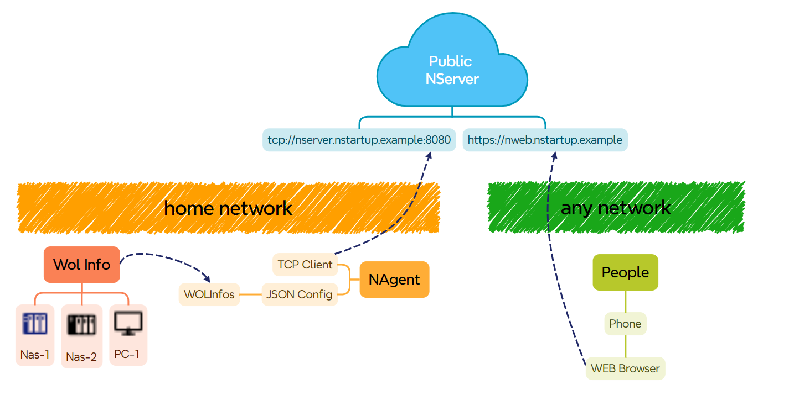

# NStartup - 一个用于远程网络唤醒管理的程序

## 项目进度
1. 设想 √
2. 架构 √
3. NServer （当前阶段）
4. NAgent
5. NQuery
6. NClient-Web
7. beta版本

## 项目简介

NStartup是一个用于远程网络唤醒管理的程序，它可以通过局域网内的广播包唤醒指定的计算机，也可以通过远程服务器唤醒指定的计算机，以及远程执行预定义动作。

项目的设立初衷是为了：
1. 家庭NAS，小型服务器节电。
2. 代替部分SSH操作，例如挂载、卸载加密分区，硬盘休眠等。
3. 通过Web界面管理，方便远程操作。

## 典型应用场景

在你的局域网应该有1台以上需要按需启动的机器，如果只有一台机器，那你可以选择可远程控制的继电器来实现要简单得多。

1. 你需要在局域网的一台低功耗主机上部署NStartup服务端，并配置好需要被唤醒的计算机信息
2. 然后这个NAgent客户端会向NServer服务端注册
3. 你可以通过NQuery接口查询到所有在线的NAgent客户端，以及每个NAgent下的WOLInfo信息
4. 然后你也可以通过NQuery接口向指定的NAgent发送唤醒指令，或者自定义指令，例如关机，硬盘休眠，挂载加密分区等，这些自定义命令也是在NAgent上配置的

## 项目结构

- NStartup.Server: 服务端程序，使用go语言开发，对NAgent提供TCP服务端。
- NStartup.Agent: 客户端程序，使用go语言开发，对NServer提供TCP客户端，对局域网发送WOL包，并允许执行本地预定义脚本，例如ssh到某个机器挂载加密分区。
- NStartup.Query: 查询程序接口，为HTTP API 和 WEBSOCKET API提供查询接口。
- NStartup.Web: Web管理界面，基于Query接口提供用户交互。

## 资源推荐
WOLDevice推荐:
- 【电脑】家用电脑无疑是成本最优选择
- 普通多盘位NAS
- 多网口组装NAS，可以作为软路由 NAS 等 All in one，但是注意你需要在上层保持一个网络为NAgent提供网络

NAgent 设备推荐： 
- 【各类可刷机openwrt路由器-例如360T6】 可以作为无线路由器的同时兼任NAgent工作，成本最优选择
- 【斐讯N1-支持5GWIFI】
- 【树莓派-成本有点高】
- 【各类电视盒子】

NServer ：
- 【本项目公共服务器】作为NServer其实负载不高，使用公共的Server可以满足绝大部分时需求
- 【自建服务器】如果你有自己的服务器，那么你可以自建一个NServer，这样你可以更好的保证隐私和安全性

NClient-Web：
- 本项目目前只有这一个用户界面，未来可能计划使用Flutter制作一个跨平台的客户端